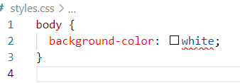

# tenantcloud-stylelint-config
> This is the default config file for stylelint from [TenantCloud](https://www.tenantcloud.com/).

Use it as is or as a basis for your own configuration.

## Installation

```bash
npm install tenantcloud-stylelint-config --save-dev
```

## Usage

If your project does not already have stylelint, then in the root of the project create the file `.stylelintrc`, or with the extension `.stylelintrc.js` so that the code editor can highlight the syntax.

Then add `tenantcloud-stylelint-config` to the `.stylelintrc` config file.

_.stylelintrc_
```json
{
  "extends": "tenantcloud-stylelint-config"
}
```

If you have installed `tenantcloud-stylelint-config` globally using the `-g` flag, then you need to use the absolute path of `tenantcloud-stylelint-config` in the config file:


_.stylelintrc_
```json
{
  "extends": "/absolute/path/to/tenantcloud-stylelint-config"
}
```

_**ATTENTION!** This config is for media [mixins](https://gist.github.com/kifork/0c449aace117fb4db7695aea34b63925) instead of expressions:_
```scss
$breakpoints: (
  xs: 0, /* <576px */
  sm: 576px, /* ≥576px */
  md: 768px, /* ≥768px */
  lg: 992px, /* ≥992px */
  xl: 1200px, /* ≥1200px */
  xxl: 1400px /* ≥1400px */
) !default;

@mixin breakpoint-min(xs);
@mixin breakpoint-max(xxl);
@mixin breakpoint-only(lg);
@mixin breakpoint-between(sm, md);
```

## Expanding the config

You can override existing rules or add new ones.

To do this, add the `"rules"` key to the config right after `"extends": "tenantcloud-stylelint-config"`, and then add your own rules.

_.stylelintrc_
```json
{
  "extends": "tenantcloud-stylelint-config",
  "rules": {
    "indentation": "tab",
    "number-leading-zero": null,
    "property-no-unknown": [ true, {
      "ignoreProperties": [
        "composes"
      ]
    }],
    "unit-whitelist": ["em", "rem", "s", "px"]
  }
}
```

## Usage in VSCode

1. Open VScode
2. Install plugin [stylelint](https://marketplace.visualstudio.com/items?itemName=stylelint.vscode-stylelint)
3. Use
4. If your code does not comply with the rules of `tenantcloud-stylelint-config` it will be underlined with a red line.



_In the example, the rule `'color-named': 'never'` was triggered, which prohibits the use of colors by name_
